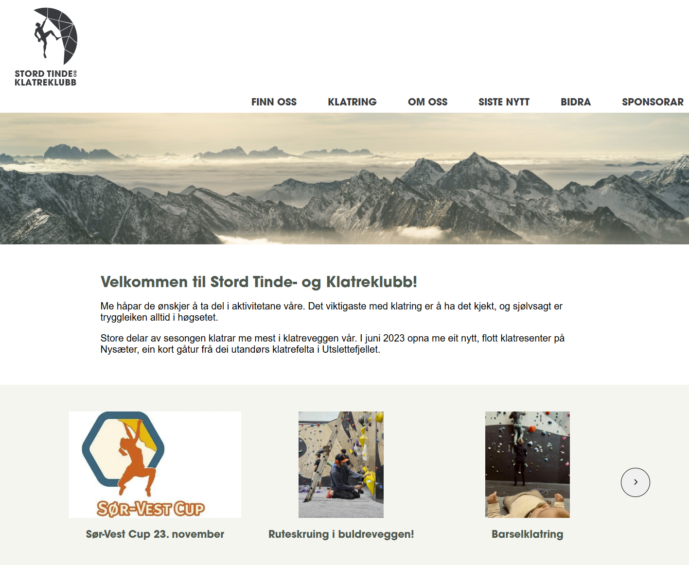

## Project Exam 1 - STOKK

Putting into practice the skills learned over my first year of studies, creating a blog site.

## Description

Prototype for a new site for my local climbing club, using WordPress for content creation, and a "headless CMS" for the website itself. The newest blog posts that are created in WordPress are shown in the carousel on the home page, and on the 'Latest news' page. The contents of specific pages created in WordPress are fetched and shown on the site.

## Built With

- HTML
- CSS
- JavaScript
- [WordPress](https://wordpress.org/)

## Getting Started

### Installing

The website needs two hosted components, one for the html/css, and one for WordPress.
Also, CORS needs to be enabled on the WordPress site.

### Running

The site is hosted on https://stokk.org/
The content is on a WordPress site, and is fetched via API.

## Contributing/Contact

The project page is on https://github.com/annikaeld/project-exam-1-annikaeld. Raise an [issue](https://github.com/annikaeld/project-exam-1-annikaeld/issues) on the project page if you have any feedback.
